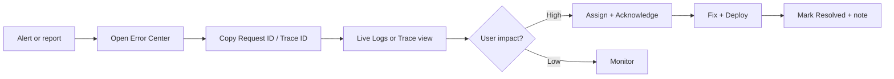

# Incident Response Playbook

## Severity levels

| Level | Definition | Example |
|-------|------------|---------|
| **Critical** | Full outage or data breach | MongoDB down; secrets in logs |
| **High** | Major feature broken for many users | Kundli 500 spike; payment verify failing |
| **Medium** | Degraded feature / elevated errors | AI fallback slow; single route 502 |
| **Low** | Minor / isolated | One user report; UI glitch |

---

## Detection sources

1. **Admin → Observability → Overview** — error rate, slow requests (1h)
2. **Admin → Observability → Error Center** — grouped fingerprints with occurrence counts
3. **Admin → User Activity → Issues** — client `app_crash`, `api_error` events
4. **Admin → Server Monitor** — CPU/memory/disk pressure
5. **External** — user reports, Razorpay dashboard, hosting alerts

---

## Triage workflow



### Step 1 — Identify

- Open error group in **Error Center**
- Note: `title`, `route`, `occurrence_count`, `affected_users`, `platform`, `app_versions`
- Click **Copy Request ID** from latest occurrence

### Step 2 — Reconstruct

- **Observability → Live Logs** → filter by `request_id`
- Or call `GET /api/admin/observability/trace/:requestId` (admin JWT)
- Cross-check **User Activity** timeline for same user/session if client-side

### Step 3 — Classify

| Pattern | Likely cause |
|---------|--------------|
| Single route spike | Controller/service regression |
| All routes 500 | MongoDB, env, deploy |
| `external_api.failed` VedAstro | Provider quota/outage |
| `external_api.failed` Gemini | AI quota; check fallback chain |
| OTP/auth spike | Abuse or misconfiguration |
| Slow without errors | Missing index; cold start; large payload |

### Step 4 — Mitigate

- **Rate limits** already on admin login, AI, payments, locations
- Toggle `PAYMENTS_ENABLED` only with business approval
- Switch AI provider via admin Settings if primary LLM down
- Scale VPS / restart process if Server Monitor shows resource exhaustion

### Step 5 — Resolve in admin

`PATCH /api/admin/observability/errors/:fingerprint`

```json
{
  "status": "investigating",
  "assigned_to": "developer@example.com",
  "notes": "VedAstro timeout — increased httpFetch timeout"
}
```

When fixed:

```json
{
  "status": "resolved",
  "notes": "Deployed fix in v1.4.3 — VedAstro retry added"
}
```

Statuses: `open` → `acknowledged` → `investigating` → `resolved` (can `reopen`)

---

## Alert rules (recommended — manual or cron phase 2)

| Rule | Threshold | Action |
|------|-----------|--------|
| Error spike | 5xx > 5% of requests over 15m | Page on-call |
| Slow API | p95 > 3s for `/api/kundli` over 10m | Investigate VedAstro |
| DB failures | Mongo connection errors > 0 | Critical — check cluster |
| OTP failures | `auth` 401/429 spike | Check abuse / rate limit |
| Crash spike | `app_crash` > 10/h | Check latest app version |
| External API | `external_api.failed` > 50/h per service | Provider status page |

Group repeated incidents by fingerprint — do not open 500 tickets for the same stack trace.

---

## Communication template

**Internal (Slack/status):**

> [High] Kundli generation errors — `KundliGenerationTimeout` — 142 occurrences / 37 users — Android 1.4.2 — investigating — assigned @dev — request sample: `m-1723…`

**User-facing (if needed):**

> We are aware of an issue affecting birth chart generation. Our team is investigating. Please try again in a few minutes.

---

## Post-incident

1. Mark error group **resolved** with root cause + fix PR link
2. Add regression test if applicable
3. Update [OBSERVABILITY-ARCHITECTURE.md](./OBSERVABILITY-ARCHITECTURE.md) or runbooks if gap found
4. Review whether new alert rule needed

---

## Security incidents

If secrets appear in logs:

1. **Rotate** affected keys immediately (JWT, Razorpay, Gemini, etc.)
2. Purge affected log documents if feasible
3. Fix redaction gap in `redact.js` + add test
4. Treat as **Critical** — document in incident notes (do not paste secrets in notes)

---

## Contacts & access

- Observability admin routes: require admin JWT only
- Future RBAC permissions: `observability.incident_manage` for status PATCH
- Normal application users: **no log access**
